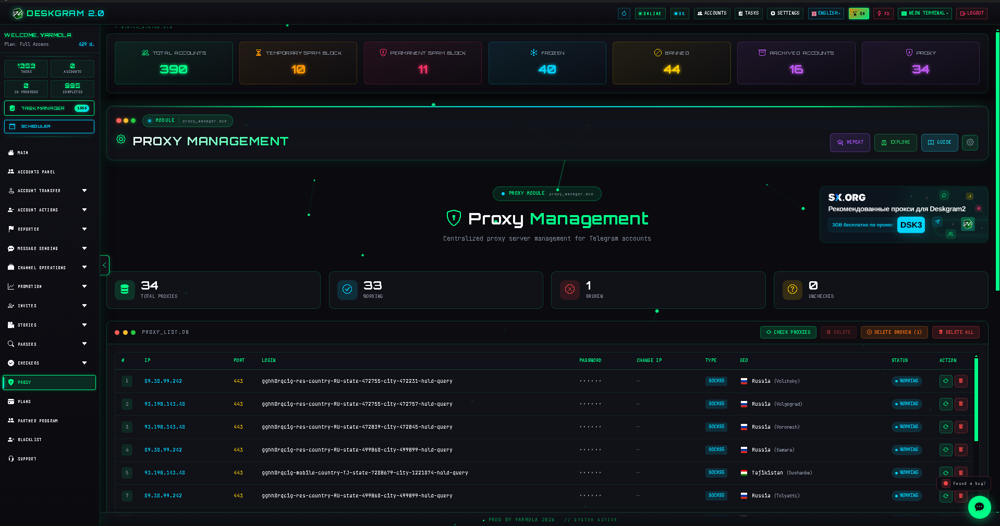
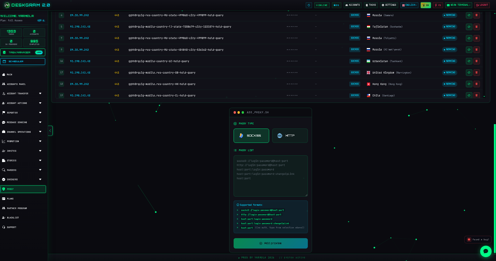
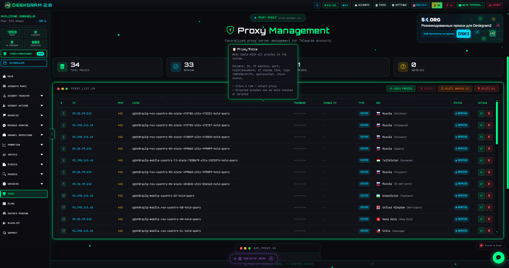
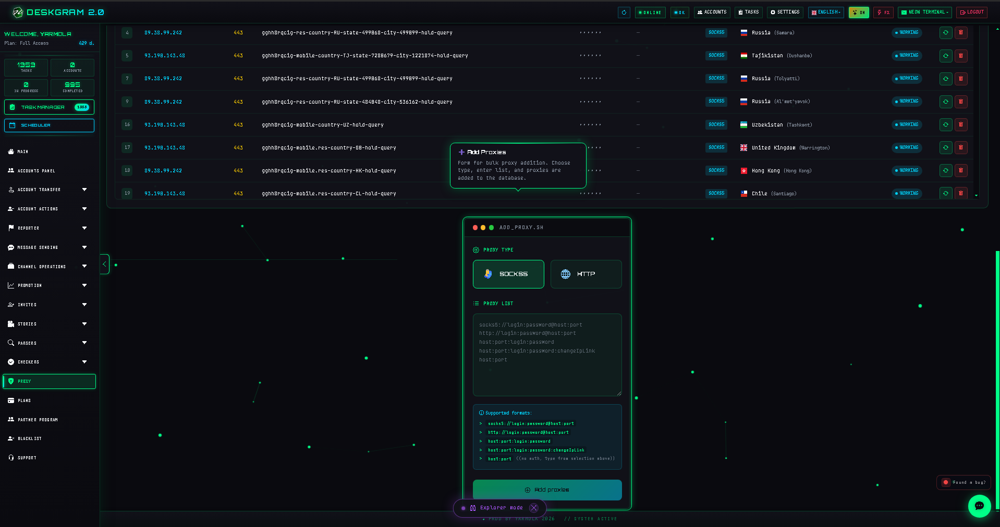

# Telegram Proxy Manager with Deskgram 2

Proxy Manager is a Deskgram 2 infrastructure section for storing, importing, checking, and assigning proxies used by Telegram accounts. It is useful when you build a stable environment for messaging, invite, parsing, and other automation scenarios.

[Deskgram 2 Hub](https://github.com/Deskgram-2/deskgram-2-telegram-automation-en) | [Website](https://deskgram2.com/) | [Telegram Bot](https://t.me/DG2welcomebot) | [Web Preview](https://deskgram2.com/web-preview)

## About the section

| Parameter | What is inside |
|---|---|
| Main task | Storage, import, and health checks for Telegram proxies |
| Supported types | `SOCKS5`, `HTTP` |
| Useful for | Account grids, outreach campaigns, invite, parsing |
| Core actions | Bulk import, checks, filtering, account binding |
| Related sections | Account Manager, Invite Tool, Settings |

## What it can do

- show a shared proxy table;
- bulk import proxies from prepared lists;
- check availability and response status;
- bind proxies to Telegram accounts;
- maintain a reusable proxy pool for automation modules;
- keep infrastructure visible in one place.

## Quick start

1. Import a proxy list.
2. Run basic checks and remove bad entries.
3. Bind proxies to the needed accounts.
4. Reuse the prepared pool in invite, messaging, or parsing workflows.

## Which execution workflows usually follow this setup

- [Direct Messaging](https://github.com/Deskgram-2/telegram-direct-messaging-deskgram-en), when outreach needs a stable account environment;
- [Invite Tool](https://github.com/Deskgram-2/telegram-invite-tool-deskgram-en), when accounts and audience are already prepared for growth tasks;
- [Audience Parser](https://github.com/Deskgram-2/telegram-audience-parser-deskgram-en), when proxy-backed data collection comes first;
- [Join Groups](https://github.com/Deskgram-2/telegram-join-groups-deskgram-en), when community participation depends on healthy infrastructure;
- [Account Manager](https://github.com/Deskgram-2/telegram-account-manager-deskgram-en), when you want to bind the working pool to a specific account grid.

## Interface highlights

### Shared proxy table

### Bulk import

### Check settings

### Account binding

## When it is especially useful

- when many Telegram accounts work in parallel;
- when you need one visible place for proxy hygiene;
- when invite, parsing, and outreach depend on stable infrastructure;
- when account binding should stay organized instead of ad hoc.

## Why it is more convenient than manual proxy handling

| Manual approach | Proxy Manager in Deskgram 2 |
|---|---|
| Proxy data is scattered across notes and files | There is one shared table for the whole workspace |
| Checks take extra time | Health checks are part of the workflow |
| Account binding becomes messy | Proxy assignment is visible and repeatable |
| It is hard to reuse the same pool | The proxy base stays centralized |
| Infrastructure is hard to maintain over time | The section supports ongoing cleanup and updates |

## Use cases

- preparing a working pool for [Direct Messaging](https://github.com/Deskgram-2/telegram-direct-messaging-deskgram-en), when outreach depends on a stable multi-account setup;
- building reserve infrastructure before [Invite Tool](https://github.com/Deskgram-2/telegram-invite-tool-deskgram-en) and [Join Groups](https://github.com/Deskgram-2/telegram-join-groups-deskgram-en);
- supporting [Audience Parser](https://github.com/Deskgram-2/telegram-audience-parser-deskgram-en) when the flow starts with discovery and data collection;
- rotating and cleaning one shared proxy layer that will be reused across several Deskgram 2 workflows.

## What to choose first: Proxy Manager or Account Manager

| If your goal is | Better starting point |
|---|---|
| Organize the account grid itself | [Account Manager](https://github.com/Deskgram-2/telegram-account-manager-deskgram-en) |
| Check connectivity and remove weak infrastructure points | `Proxy Manager` |
| Prepare a stable base for large-scale execution | Start with Account Manager, then move into `Proxy Manager` |
| Standardize the whole workspace before launch | Accounts and proxies first, then [Settings](https://github.com/Deskgram-2/telegram-automation-settings-deskgram-en) |

## Related repositories

- [Deskgram 2 Hub](https://github.com/Deskgram-2/deskgram-2-telegram-automation-en)
- [Account Manager](https://github.com/Deskgram-2/telegram-account-manager-deskgram-en)
- [Invite Tool](https://github.com/Deskgram-2/telegram-invite-tool-deskgram-en)
- [Automation Settings](https://github.com/Deskgram-2/telegram-automation-settings-deskgram-en)
- [Direct Messaging](https://github.com/Deskgram-2/telegram-direct-messaging-deskgram-en)
- [Audience Parser](https://github.com/Deskgram-2/telegram-audience-parser-deskgram-en)
- [Join Groups](https://github.com/Deskgram-2/telegram-join-groups-deskgram-en)

## FAQ

### Which proxy types are typically used here?

The interface is usually built around `SOCKS5` and `HTTP`.

### Why keep proxies in a separate section?

Because infrastructure becomes easier to manage when it is not mixed into every module individually.

### Which modules benefit from it most?

Invite, parsing, messaging, and any workflow that depends on large account grids.
